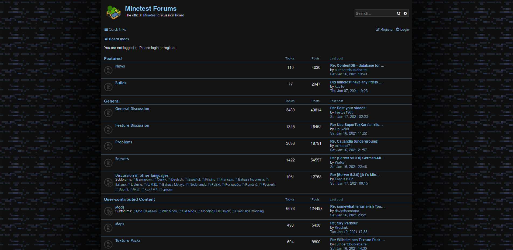

# Obsidian Minetest Forum
Dark [Minetest Forum](https://forum.minetest.net/) Userstyle by GreenXenith  
  

## Installation
1. Install [Stylus for Firefox](https://addons.mozilla.org/en-US/firefox/addon/styl-us/), [Chrome](https://chrome.google.com/webstore/detail/stylus/clngdbkpkpeebahjckkjfobafhncgmne), [Opera](https://addons.opera.com/en-gb/extensions/details/stylus/) or [Cascadea for Safari](https://cascadea.app/).
2. Install [obsidian-minetest-forum.user.css](https://raw.githubusercontent.com/GreenXenith/obsidian-minetest-forum/master/obsidian-minetest-forum.user.css).
  
License: MIT
